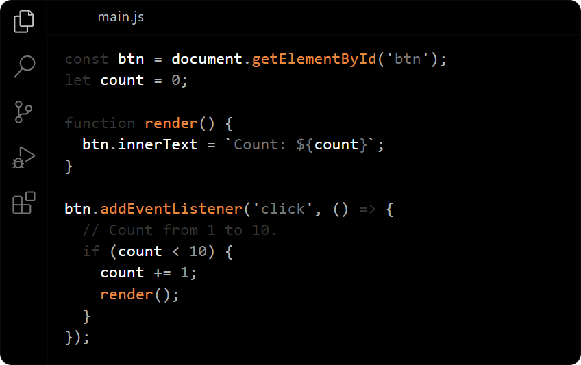

# melted.

Theme for VS Code born from the hottest volcanoes. 🌋

## Installation

1. Visit the [VS Marketplace](https://marketplace.visualstudio.com/items?itemName=evvvrado.melted).
2. Click the "Install" button.
3. After installation, [select the theme](https://code.visualstudio.com/docs/getstarted/themes#_selecting-the-color-theme). The **elted** theme is available as a single dark option designed for a seamless coding experience.

## Customize the Melted Theme

To customize this theme or any other, you can modify your personal configuration file. Refer to the [color theme](https://code.visualstudio.com/api/extension-guides/color-theme) documentation for guidance. This allows you to make small adjustments without needing to fork and maintain your own version of the theme.

## Disclaimer

This theme was quickly assembled for personal use, with no prior experience in theme development, and may have untested edge cases.

And, the theme is based on [Monochrome Dark Amplified](https://vscodethemes.com/e/anotherglitchinthematrix.monochrome/monochrome-dark-amplified?language=javascript).
